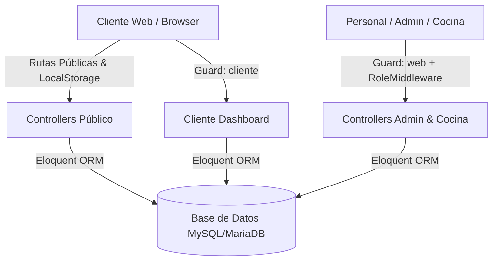

# 01 - Arquitectura y Estructura del Sistema

## 📌 Visión General

**La Parrilla – Asadero El Carbón** es una aplicación web de pedidos y gestión de restaurantes construida sobre **Laravel 11**. Proporciona una solución integral autoservicio para clientes en mesa y entrega, así como panales operativos diferenciados para la cocina y la administración del establecimiento.

### Características Principales:
- **Catálogo digital interactivo:** Filtrado dinámico por categorías en tiempo real.
- **Carrito de compras híbrido:** Gestión en `localStorage` del cliente con sincronización y validación estricta en backend.
- **Doble sistema de autenticación (Multi-Guard):** Separación total entre usuarios del staff (`Usuario`) y compradores (`Cliente`).
- **Control de estados en tiempo real para Cocina:** Gestión interactiva de comandas (`recibido` → `en_preparacion` → `listo` → `entregado` → `pagado`).
- **Administración centralizada:** Métricas en tiempo real, gestión de catálogo, control de stock/agotados, administración de mesas y reporte de ventas.

---

## 🏗️ Patrones de Arquitectura y Diseño

El proyecto sigue una arquitectura **MVC (Modelo-Vista-Controlador)** desacoplada por dominios de negocio:



### 1. Autenticación Doble Guard (Multi-Guard)
El sistema utiliza dos provisores de autenticación independientes definidos en `config/auth.php`:
- **Guard `web`:** Asociado al modelo `App\Models\Usuario`. Autentica al personal del restaurante (Administradores y personal de Cocina).
- **Guard `cliente`:** Asociado al modelo `App\Models\Cliente`. Autentica a los clientes compradores.

### 2. Transacciones de Base de Datos (`DB::transaction`)
El procesamiento de pedidos (`CarritoController::procesar`) se ejecuta dentro de transacciones atómicas de base de datos para garantizar la integridad referencial y evitar incoherencias en precios, stock o correlativos de pedido.

### 3. Historial de Estados Inmutable
Cada cambio de estado de un pedido se registra en la tabla `pedido_estados_historial`, lo que asegura auditabilidad completa sobre quién cambió el estado y en qué fecha/hora.

---

## 📂 Organización del Proyecto

```
la-parrilla/
├── app/
│   ├── Http/
│   │   ├── Controllers/
│   │   │   ├── Admin/              # Dashboard, Mesas, Pedidos, Productos, Usuarios, Ventas
│   │   │   ├── Auth/               # Login, Registro, Recuperación de contraseña
│   │   │   ├── Cliente/            # Dashboard y Pedidos del Cliente
│   │   │   ├── Cocina/             # Comandas y Agotamiento de Productos
│   │   │   ├── Publico/            # Home, Carrito, Confirmación
│   │   │   └── Staff/              # Cambio genérico de estado de pedidos
│   │   └── Middleware/             # RoleMiddleware (Control de roles de staff)
│   └── Models/                     # Modelos Eloquent de la aplicación
├── config/                         # Configuraciones del framework (auth, database, etc.)
├── database/
│   ├── migrations/                 # Migraciones de esquemas de BD y vistas SQL
│   └── seeders/                    # Datasets de roles, usuarios, categorías y productos
├── docs/                           # Documentación detallada en Markdown
├── public/                         # Assets públicos (CSS, JS, imágenes)
├── resources/
│   └── views/                      # Plantillas Blade (admin, auth, cliente, cocina, layouts, publico)
└── routes/
    ├── web.php                     # Definición de rutas y agrupaciones con middleware
    └── console.php                 # Comandos Artisan personalizados
```
