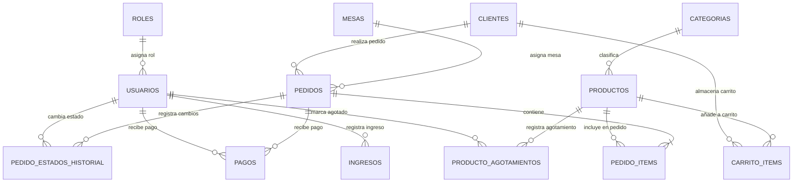

# 02 - Base de Datos y Modelos Eloquent

## 🗄️ Esquema de la Base de Datos

La base de datos está diseñada relacionalmente para dar soporte al flujo transaccional de restaurantes.

---

## 📋 Diccionario de Tablas y Modelos

### 1. `roles` (`App\Models\Rol`)
Almacena los roles del personal administrativo y operativo.
- `id` (PK, Auto-increment)
- `nombre` (string): Identificador del rol (`administrador`, `cocina`, `mesero`).
- `descripcion` (string, nullable)

### 2. `usuarios` (`App\Models\Usuario`)
Usuarios pertenecientes al staff interno del restaurante.
- `id` (PK, Auto-increment)
- `rol_id` (FK -> `roles.id`)
- `nombre` (string)
- `email` (string, único)
- `password` (string)
- `activo` (boolean, default true)
- `ultimo_login` (datetime, nullable)

### 3. `clientes` (`App\Models\Cliente`)
Compradores registrados en la plataforma pública.
- `id` (PK, Auto-increment)
- `nombre` (string)
- `email` (string, único)
- `telefono` (string, nullable)
- `password` (string)
- `direccion` (text, nullable)

### 4. `categorias` (`App\Models\Categoria`)
Categorías del menú (ej: Entradas, Carnes a la Parrilla, Bebidas, Postres).
- `id` (PK, Auto-increment)
- `nombre` (string)
- `slug` (string, único)
- `descripcion` (text, nullable)
- `orden` (integer, default 0)
- `activo` (boolean, default true)

### 5. `productos` (`App\Models\Producto`)
Items del menú disponibles para la venta.
- `id` (PK, Auto-increment)
- `categoria_id` (FK -> `categorias.id`)
- `nombre` (string)
- `descripcion` (text, nullable)
- `precio` (decimal 10,2)
- `imagen_url` (string, nullable)
- `disponibilidad` (boolean, default true)
- `orden` (integer, default 0)

### 6. `mesas` (`App\Models\Mesa`)
Mesas físicas del establecimiento.
- `id` (PK, Auto-increment)
- `numero` (integer, único)
- `capacidad` (integer)
- `ocupada` (boolean, default false)

### 7. `pedidos` (`App\Models\Pedido`)
Cabecera de las órdenes de compra.
- `id` (PK, Auto-increment)
- `codigo` (string, único): Identificador corto de la orden (ej: `ORD-20240916-ABCD`).
- `cliente_id` (FK -> `clientes.id`, nullable): Nulo en compras anónimas / autoservicio.
- `mesa_id` (FK -> `mesas.id`, nullable): Nulo si es para llevar.
- `tipo_entrega` (enum: `mesa`, `llevar`)
- `estado` (enum: `recibido`, `en_preparacion`, `listo`, `entregado`, `pagado`, `cancelado`)
- `subtotal` (decimal 10,2)
- `propina` (decimal 10,2, default 0)
- `total` (decimal 10,2)
- `notas` (text, nullable)

### 8. `pedido_items` (`App\Models\PedidoItem`)
Detalle de productos comprados en una orden.
- `id` (PK, Auto-increment)
- `pedido_id` (FK -> `pedidos.id`)
- `producto_id` (FK -> `productos.id`)
- `nombre_producto` (string): Copia histórica del nombre.
- `precio_unitario` (decimal 10,2): Copia histórica del precio al momento de compra.
- `cantidad` (integer)
- `subtotal` (decimal 10,2)
- `notas` (string, nullable)

### 9. `pedido_estados_historial` (`App\Models\PedidoEstadoHistorial`)
Auditabilidad de transiciones de estados del pedido.
- `id` (PK, Auto-increment)
- `pedido_id` (FK -> `pedidos.id`)
- `estado_anterior` (string)
- `estado_nuevo` (string)
- `cambiado_por_usuario_id` (FK -> `usuarios.id`, nullable)
- `nota` (string, nullable)

### 10. `pagos` (`App\Models\Pago`)
Registro de liquidación de pedidos.
- `id` (PK, Auto-increment)
- `pedido_id` (FK -> `pedidos.id`)
- `metodo_pago` (enum: `efectivo`, `tarjeta`, `nequi`, `daviplata`, `transferencia`)
- `monto` (decimal 10,2)
- `propina` (decimal 10,2)
- `total_pagado` (decimal 10,2)
- `referencia_transaccion` (string, nullable)
- `recibido_por_usuario_id` (FK -> `usuarios.id`, nullable)

### 11. `ingresos` (`App\Models\Ingreso`)
Ingresos auxiliares o cierres de caja registrados por administración.
- `id` (PK, Auto-increment)
- `concepto` (string)
- `monto` (decimal 10,2)
- `fecha` (date)
- `registrado_por_usuario_id` (FK -> `usuarios.id`)

---

## 📊 Vistas SQL (`reporting_views`)

La migración `2024_01_01_000015_create_reporting_views.php` crea vistas de reporte para consultas rápidas:
1. `vw_resumen_ventas_diarias`: Consolida total vendido, número de pedidos y ticket promedio por fecha.
2. `vw_productos_mas_vendidos`: Ranking de productos agrupados por cantidad demandada.
