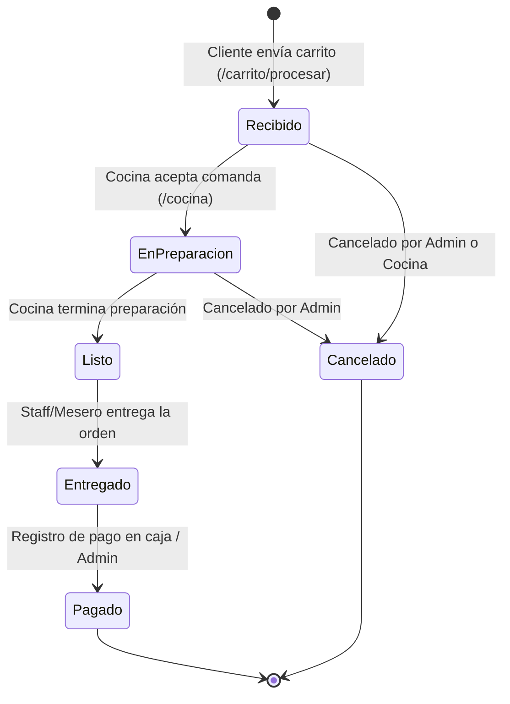

# 03 - Módulos del Sistema y Flujos de Trabajo

## 🔄 Flujo General del Pedido

---

## 🍽️ 1. Módulo Público y Carrito Autoservicio

### Funcionamiento:
1. **Navegación del Menú (`/`):**
   - Muestra productos activos organizados por categorías.
   - Permite filtrar por categorías dinámicamente mediante JavaScript.
   - Muestra badge de disponibilidad ("Agotado" o "Disponible").

2. **Gestión del Carrito (`localStorage`):**
   - Los productos seleccionados se guardan inmediatamente en el `localStorage` del cliente.
   - Permite modificar cantidades, agregar especificaciones/notas por producto y visualizar el subtotal en tiempo real.

3. **Checkout (`/carrito` & `/carrito/procesar`):**
   - El cliente selecciona el tipo de entrega (`mesa` o `llevar`).
   - Si es para mesa, selecciona la mesa disponible.
   - Al procesar, el backend valida la existencia y disponibilidad de los productos dentro de una transacción `DB::transaction`.
   - Marca la mesa como `ocupada` (si aplica).
   - Genera el código único del pedido y limpia el `localStorage`.
   - Redirige a la pantalla de confirmación (`/confirmacion?orden=...`).

---

## 👨‍🍳 2. Módulo de Cocina (`/cocina`)

Acceso restringido para el personal con rol `cocina` (Guard `web`).

### Pantalla 1: Comandas en Vivo (`/cocina`)
- Muestra los pedidos en estado `recibido` y `en_preparacion` ordenados por hora de creación.
- Permite pasar el pedido a `en_preparacion` o `listo` mediante botones de acción rápida.
- Muestra el tiempo transcurrido desde que se creó el pedido para controlar los tiempos de atención.

### Pantalla 2: Control de Disponibilidad (`/cocina/productos`)
- Permite a la cocina marcar temporalmente un producto como "Agotado".
- Registra la novedad en la tabla `producto_agotamientos`.
- Un producto agotado se deshabilita automáticamente en el menú público impidiendo nuevos pedidos.

---

## 🔐 3. Módulo Autenticación y Registro (`/login`, `/registro`, `/recuperar-password`)

- **Formulario de Login Unificado:** Permite el ingreso tanto de clientes como del personal del staff.
- **Registro de Clientes:** Registra un nuevo cliente con guard `cliente` y contraseña cifrada con `Bcrypt`.
- **Recuperación de Contraseña:** Procesa la solicitud mediante tokens de caducidad almacenados en `tokens_recuperacion`.

---

## 💼 4. Módulo Administrador (`/admin`)

Acceso restringido para el personal con rol `administrador` (Guard `web`).

### Funcionalidades:
1. **Dashboard General (`/admin`):** Métricas clave del día (Ventas totales, pedidos activos, mesas ocupadas, resumen de ingresos).
2. **Gestión de Productos (`/admin/productos`):** CRUD completo de productos y categorías, asignación de precios e imágenes.
3. **Gestión de Usuarios Staff (`/admin/usuarios`):** Creación y edición de cuentas de administradores, cocineros y meseros. Activar/desactivar acceso.
4. **Gestión de Mesas (`/admin/mesas`):** Monitoreo del estado de las mesas (disponible/ocupada) y botón de liberación global o individual.
5. **Reporte de Ventas (`/admin/ventas`):** Filtro por rangos de fecha para consultar totales recaudados, ticket promedio e ingresos registrados.

---

## 👤 5. Módulo Mi Cuenta Cliente (`/mi-cuenta`)

Acceso restringido para clientes autenticados (Guard `cliente`).

- Muestra la información del perfil del cliente.
- Listado de pedidos anteriores con estado actual, fecha, tipo de entrega y monto total.
- Vista detallada de cada pedido (`/mi-cuenta/pedidos/{pedido}`).
